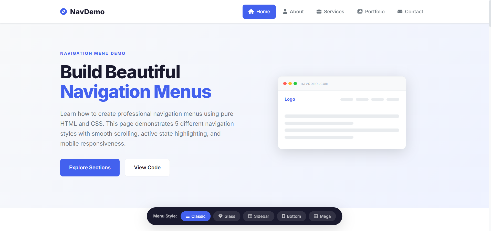
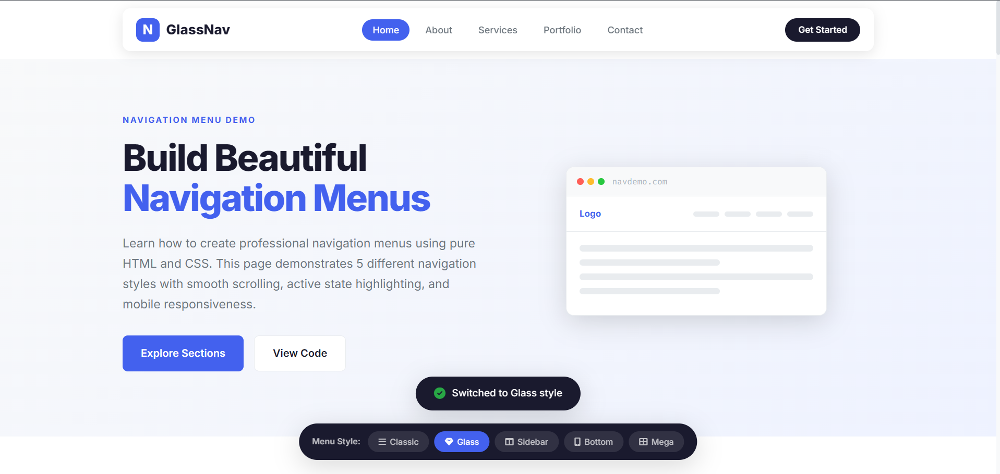
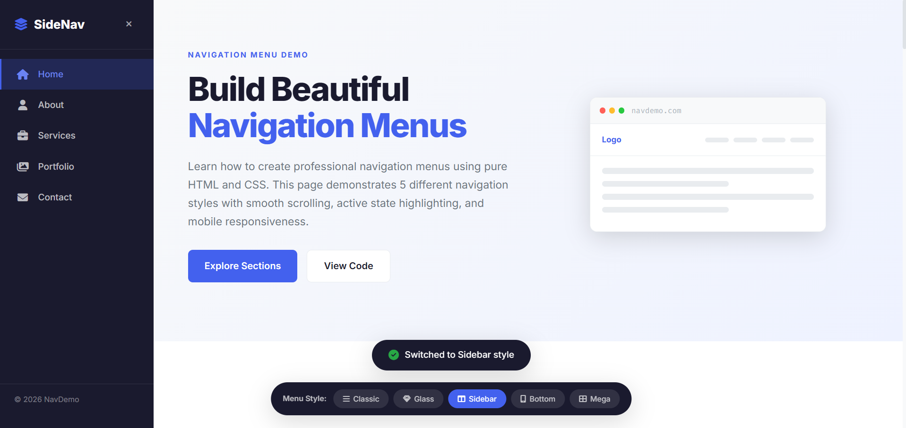
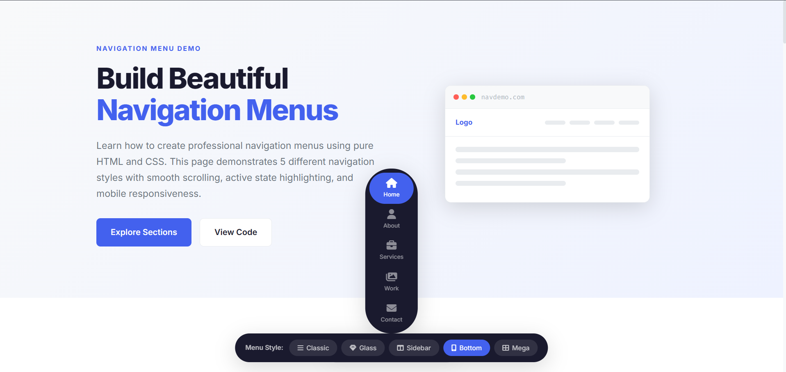
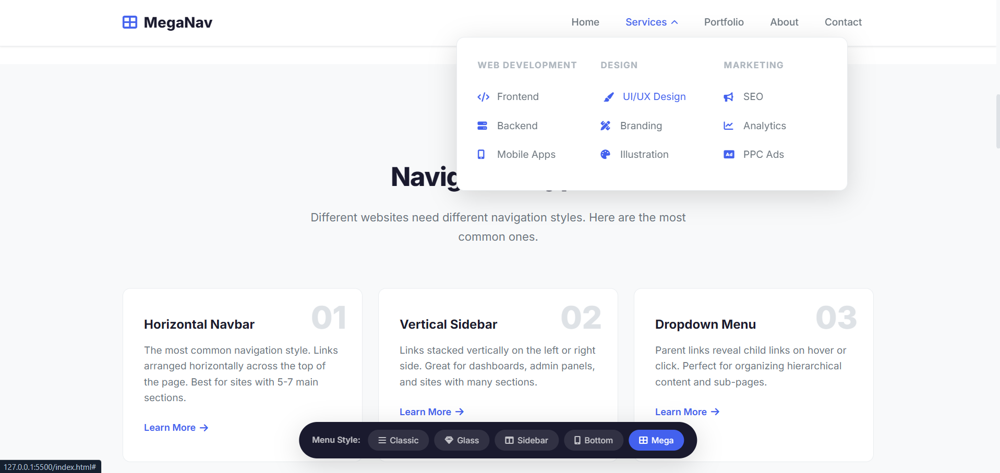

# Navigation Menu Demo

A complete, interactive webpage demonstrating **5 different navigation menu styles** built with pure **HTML, CSS, and JavaScript**. Perfect for learning how to create professional and responsive navigation menus.

---

## 🚀 Live Demo

🔗 **Live Website:** https://veeranishanth.github.io/Navigation-menu

---

## 📂 GitHub Repository

🔗 **Repository:** https://github.com/veeranishanth/navigation-menu

---

## ✨ 5 Navigation Styles Included

| Style | Description | Best For |
|-------|-------------|----------|
| **Classic** | Traditional horizontal navbar with logo left, links right | Standard websites |
| **Glass** | Frosted glass effect with rounded corners | Modern portfolios |
| **Sidebar** | Fixed vertical menu on the left | Dashboards & Admin Panels |
| **Bottom** | Tab bar fixed to the bottom of the screen | Mobile Apps |
| **Mega** | Horizontal navbar with multi-column dropdown | E-commerce Websites |

---

## ✨ Features

- 🎨 5 Navigation Menu Styles
- 📱 Fully Responsive Design
- 🍔 Mobile Hamburger Menu
- 🔄 Style Switcher
- 🎯 Scroll Spy Navigation
- ✨ Smooth Scrolling
- 📝 Contact Form
- ♿ Accessible Navigation (ARIA & Keyboard Support)
- 📋 Copy Ready Code Example
- ⚡ Built with Vanilla JavaScript

---

## 🛠️ Tech Stack

- HTML5
- CSS3
- JavaScript (ES6)

---

## 📁 Project Structure

```text
navigation-menu/
│
├── index.html
├── css/
│   └── style.css
├── js/
│   └── main.js
└── README.md
```

---

## ▶️ Getting Started

1. Clone the repository

```bash
git clone https://github.com/your-username/navigation-menu.git
```

2. Open the project folder.

3. Open `index.html` in your browser.

No installation or build process required.

---

## 🌐 Deployment

This project can be deployed easily on:

- GitHub Pages
- Netlify
- Vercel

---

## 📖 HTML Concepts Used

- Semantic `<nav>`
- Anchor Navigation
- Lists (`ul`, `li`)
- Buttons
- Forms

---

## 🎨 CSS Concepts Used

- CSS Grid
- Media Queries
- CSS Variables
- Backdrop Filter
- Transitions & Animations
- Transform

---

## 📸 Screenshots

### Classic Navigation


### Glass Navigation


### Sidebar Navigation


### Bottom Navigation


### Mega Navigation


---

## 👨‍💻 Author

**Nishanth Veera**

### GitHub

https://github.com/veeranishanth

### LinkedIn

https://www.linkedin.com/in/veeranishanth/

---

## 📬 Connect

Feel free to connect, contribute, or share feedback!

⭐ Don't forget to star the repository if you found it useful.

---

## 📄 License

This project is licensed under the **MIT License**.
